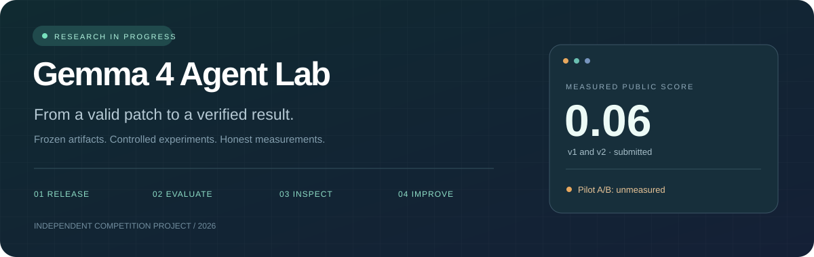
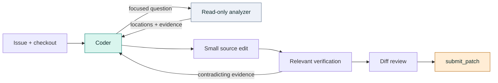

<p align="center">
  
</p>

<p align="center">
  <a href="https://github.com/ns-0437/gemma4-agent-lab/actions/workflows/ci.yml"></a>
  
  
  
</p>

<p align="center">
  <a href="#results">Results</a> ·
  <a href="#how-it-works">Architecture</a> ·
  <a href="#try-it-without-the-data">Quickstart</a> ·
  <a href="https://ns-0437.github.io/gemma4-agent-lab/docs/explorer/">Interactive explorer ↗</a> ·
  <a href="docs/EXPERIMENTS.md">Experiment protocol</a>
</p>

# A coding agent, with an evidence trail.

An independent research project for the [Gemma 4 Developer Agent competition](https://www.kaggle.com/competitions/gemma-4-developer-agent): frozen agent prompts, reproducible submission builds, guarded evaluation, and an honest record of what worked—and what did not.

**v1, v2 and v3 each scored 0.06**, according to the owner's submissions screenshot.
The subsequent single-task recovery experiment produced no patch and never reached grading:
60 tool calls, no rejected calls, and a repeated command loop. A concise-prompt A/S comparison
was launched on September 30; its outcome has not been reviewed in this checkpoint.
No candidate winner is established. [Current experiment checkpoint →](docs/STAGE1_AND_AS.md)

> **Code-only public repository.** No 22 GB competition bundle, task answers, model weights, credentials or raw traces. The public tests run on invented fixtures. [Read the data policy →](docs/DATA_POLICY.md)

## Results

Snapshot: **30 September 2026**. Scores are from the owner's Kaggle submissions screenshot; hidden per-task outcomes are unavailable.

| Artifact | What changed | Public score | Evidence |
|:--|:--|:--:|:--|
| **v1** | Coder + analyzer, structured repair workflow | **0.06** | Submitted |
| **v2** | Direct search, optional analyzer, bounded investigation | **0.06** | Submitted |
| **v3** | Prompt reliability changes | **0.06** | Submitted; owner screenshot |
| **v2_reviewed / A** | Scratch tooling and import-provenance improvements | — | Unsubmitted; compiled locally |
| **B** | A with thinking enabled for both agents | — | Unsubmitted; compiled locally |

The A/B labels above belong to the **original pilot**. The later prompt comparison uses
**A = submitted v3** and **B = a shorter prompt**, both with thinking off. They are separate experiments.

Equal aggregate scores do not prove the same tasks were solved. A two-task pilot cannot establish a general winner. The project makes no claim of a guaranteed rank or prize.

<details>
<summary><strong>Inspect artifact identity and the v1 ZIP caveat</strong></summary>

Frozen source lives in [`releases/`](releases). [`manifest.json`](releases/manifest.json) records full hashes and status. Submitted v2 starts `6918f2c4…`; unsubmitted pilot A starts `f6392b82…`. They are different artifacts.

v1 predates normalized ZIP metadata. Its original uploaded ZIP and a reproducible rebuild have different archive hashes, even though every source entry was verified byte-identical. Both identities are recorded explicitly. Frozen files disable Git newline conversion.

```bash
python scripts/verify_releases.py
```

</details>

## How it works



The coder owns the patch. The analyzer supplies evidence when navigation is unclear. Both use one base model. The current hypothesis is that fewer unproductive searches, reliable edit mechanics and issue-specific verification can improve useful patches—not that a longer prompt is automatically better.

| Layer | Responsibility | Start here |
|:--|:--|:--|
| Agent | Instructions, sampling and tools | [`submission/`](submission), [architecture](docs/AGENT.md) |
| Release | Frozen source and exact archive identity | [`releases/`](releases), [packaging tests](tests/test_packaging.py) |
| Evaluation | Provenance, baseline/gold controls, model lifecycle | [generators](docs/NOTEBOOKS.md), [protocol](docs/EXPERIMENTS.md) |
| Evidence | Status, caveats, review findings | [`results.json`](docs/results.json), [lessons](docs/LESSONS.md) |

## Try it without the data

Python **3.12+**. No Kaggle account, model download or GPU required for public checks.

```bash
git clone https://github.com/ns-0437/gemma4-agent-lab.git
cd gemma4-agent-lab
python -m pip install -r requirements-dev.txt
python scripts/run_checks.py
```

This verifies frozen release hashes, packaging/data-boundary tests and the **82-assertion synthetic pilot suite in both saved dispatch states**. CI repeats CPU validation on Linux and Windows. These tests do not serve Gemma or solve competition tasks.

<details>
<summary><strong>Build a submission notebook locally</strong></summary>

```bash
python scripts/validate_and_zip.py releases/v2 --no-zip
python scripts/make_submit_notebook.py --source releases/v2 --version v2
```

Generated files are ignored. The metadata defaults to `YOUR_KAGGLE_USERNAME`; set `KAGGLE_KERNEL_OWNER` in your process environment before an authorized push. Generation does not upload or submit anything. The local validator is an approximation; [official compilation](docs/COMPILER.md) is a separate gate.

</details>

<details>
<summary><strong>Explore the results locally</strong></summary>

```bash
python -m http.server 8000 --bind 127.0.0.1
```

Open `http://127.0.0.1:8000/docs/explorer/`. Filter submitted/candidate releases, inspect each hypothesis and full hash, and follow the experiment stages. The explorer reads the same JSON manifests as the checks; it uses no analytics or external JavaScript dependencies.

</details>

## What the review caught

<details open>
<summary><strong>01 / Reliable execution before model comparisons</strong></summary>

Disabled dispatch once still started the model server. Tests now check construction, startup, evaluation and shutdown separately. Timing wrappers once missed Evaluator's imported bindings. Setup probes now run in each actual sandbox path; missing controls fail closed. [Review lessons →](docs/LESSONS.md)

</details>

<details>
<summary><strong>02 / The runtime can disagree with the source you read</strong></summary>

Subprocess evaluation imported an installed package instead of the checkout. A successful reproduction could therefore validate the wrong code. Evaluation repairs and provenance controls address the proxy; they do not establish that official Docker grading has the same bug.

</details>

<details>
<summary><strong>03 / A passing assertion is not a performance result</strong></summary>

The local suite grew from 22 checks that missed important paths to 82 checks. The public export uses synthetic tasks and a synthetic forwarding fixture to avoid redistributing competition material. Real-model quality, runtime tails and private-set generalization remain unmeasured.

</details>

## Next experiment

- [x] Preserve scored release identities and separate unsubmitted candidates.
- [x] Repair lifecycle, provenance, report-schema and dispatch tests.
- [x] Publish a data-free, CPU-testable research repository.
- [x] Run the explicitly authorized four-run A/B pilot (2 of 4 executed; 0 graded).
- [x] Read every trace; select one demonstrated failure mode (test-file tampering).
- [ ] Validate a representative development/held-out set before another agent comparison.
- [ ] Compare on broader development tasks, then untouched holdout tasks.

[Roadmap](docs/ROADMAP.md) · [Reproducibility](docs/REPRODUCIBILITY.md) · [Operations](docs/OPERATIONS.md) · [Contributing](CONTRIBUTING.md)

---

Maintained by **Navin Kumar** · [GitHub](https://github.com/ns-0437) · [Kaggle](https://www.kaggle.com/navin03)

Independent project; no affiliation or endorsement implied. Claude and Codex assisted development and review. The Git history records this present-day import and subsequent improvements, not invented historical work. See [provenance and rights](NOTICE.md).
